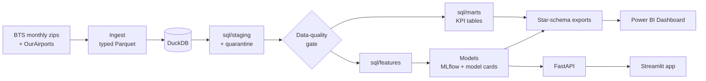

# Flight Disruption Intelligence

Which US domestic flights are likely to run late or get cancelled, where does disruption build up, and what does next week look like at the big airports?

I built this end to end on **7.04 million real flights** from the US DOT on-time dataset (Aug 2025 – Jul 2026): a DuckDB warehouse with a data-quality gate, SQL KPI marts, six models evaluated on a time-based split, a FastAPI scoring service, a Streamlit app and a six-page Power BI dashboard.

**Demo:** [app demo (75 s)](./artifacts/flight-disruption-demo.mp4) · [dashboard walkthrough (56 s)](./artifacts/powerbi-dashboard-walkthrough.mp4)


## The problem

Across these 12 months, **22.4% of completed flights arrived 15+ minutes late** and **1.82% were cancelled**. A late flight was late by **72.5 minutes** on average. Planners, airport ops teams and travel managers keep asking the same four questions:

- Where and when does delay concentrate (carrier, airport, route, hour)?
- What causes it: the airline, weather, air traffic control, or a late inbound aircraft?
- Which scheduled flights are riskiest, using only what's known when the schedule is published?
- What's coming over the next 7 days, and which past days were real disruption events?

## What I built

| Layer | What it does |
|---|---|
| Data pipeline | Pulls 12 monthly BTS files (~360 MB zipped) into typed Parquet and DuckDB, adds OurAirports metadata, and stops on any failure of a 26-check data-quality gate |
| SQL | `sql/staging` cleans and quarantines bad source rows, `sql/marts` builds the KPI tables, `sql/features` builds the model features |
| Machine learning | Delay classifier, delay-minutes quantile regression, cancellation risk, 7-day airport forecasts, airport/route segmentation, disruption-day detection, SHAP explanations. Tracked in MLflow, with versioned artifacts and a model card each |
| API | FastAPI: `/predict/delay`, `/predict/cancellation`, `/explain`, `/forecast`, `/health` |
| App | Streamlit: overview, delay-risk predictor with reasons, forecasts, segments, disruption days, model performance |
| Power BI Dashboard | Six pages on a star schema (`fact_flights`, `dim_date`, `dim_carrier`, `dim_airport`, `dim_route` plus model score tables) with 40 DAX measures |
| Engineering | Makefile, Docker, GitHub Actions (ruff + pytest), executed notebooks |

## Power BI Dashboard

[Dashboard walkthrough (56 s)](./artifacts/powerbi-dashboard-walkthrough.mp4)

| | |
|---|---|
| **1 · Executive Overview**: 7.04M flights, 77.6% on time, 8.1 min average arrival delay, 1.82% cancelled; monthly trend, carrier ranking, delay causes, delay by hour, busiest airports  | **2 · Carrier Performance**: scorecard for 14 carriers, punctuality vs cancellations, carrier × month heatmap, cause mix by carrier  |
| **3 · Airport & Route Drill-down**: top airports by volume and delay rate, congestion vs delay, least reliable routes, hour × weekday heatmap  | **4 · Delay Causes**: delay minutes by cause and month, cancellations by reason, most weather-exposed airports  |
| **5 · ML Risk Scores**: calibration by risk band, predicted vs observed by hour and carrier, highest-risk routes, average cancellation risk  | **6 · Forecast & Disruption Watch**: flagged disruption days, 7-day forecasts for the busiest airports, backtest error vs baselines  |

What the dashboard shows:

- Hawaiian had the best on-time rate (81.9%) and JetBlue the worst (72.3%). PSA had the highest cancellation rate (4.29%).
- Late-arriving aircraft cause 39.7% of attributed delay minutes, more than any other cause. Weather accounts for 62% of cancellations.
- Delay risk builds through the day, from under 10% for 5–6 am departures to about 32% for 7–8 pm departures.
- 2026-01-25 was the worst day in the window, with 46.5% of flights cancelled.

### Open in Power BI Desktop

1. Clone the repo and open `dashboard/FlightDisruption.pbip` in Power BI Desktop.
2. Go to **Transform data → Edit parameters** and set `DataFolder` to the full path of your local `data/powerbi` folder (for example `C:\flight-disruption-intelligence\data\powerbi`).
3. Click **Refresh**.

A fresh clone loads the 50,000-row fact samples that are committed to the repo. After `make data && make pipeline`, the same report picks up the full fact tables (every flight) from that folder automatically. The measures are documented in [`dashboard/DAX_MEASURES.md`](./dashboard/DAX_MEASURES.md), and the theme is in `dashboard/theme/`.

## Model results

Train Aug 2025 – Mar 2026, validate Apr – May 2026, test Jun – Jul 2026. Tuning, calibration and thresholds use the validation window only, and the pre-departure models only see features that are known when the schedule is published.

**Arrival delay > 15 min** (1,207,232 completed test flights, 27.0% delayed)

| Model | ROC-AUC | PR-AUC | F1 | Brier |
|---|---|---|---|---|
| Prior rate (baseline) | 0.500 | 0.271 | 0.000 | 0.2004 |
| Logistic regression (baseline) | 0.680 | 0.412 | 0.488 | 0.1841 |
| XGBoost | 0.681 | 0.415 | 0.487 | 0.1867 |
| **LightGBM + Optuna, calibrated (served)** | **0.688** | **0.419** | **0.491** | **0.1857** |

The gain over logistic regression is small. Most delay comes from same-day weather and knock-on effects that nobody knows at scheduling time. A day-of-operations version that uses the actual aircraft rotation reaches 0.711 AUC, but I don't serve it because the tail number is only known after the fact.

**Delay minutes** (quantile LightGBM)

| Model | MAE (min) | RMSE (min) | Median AE |
|---|---|---|---|
| Global median (baseline) | 29.81 | 71.13 | 13.00 |
| Route median (baseline) | 29.69 | 71.08 | 13.00 |
| **LightGBM P50** | **28.84** | 70.13 | 12.53 |

Pinball loss beats the baseline at P10 (4.05 vs 4.25), P50 (14.42 vs 14.90) and P90 (13.23 vs 14.15). The P90 covers 86.7% of test flights and the P10–P90 band covers 77.1%.

**Cancellation risk** (1,239,546 test flights, 2.14% cancelled)

| Model | Validation PR-AUC | Test PR-AUC | Test ROC-AUC | Test Brier |
|---|---|---|---|---|
| Prior rate (baseline) | – | 0.021 | 0.500 | 0.0210 |
| **Logistic regression, class-weighted + Platt scaling (served)** | 0.0165 | **0.059** | **0.731** | **0.0210** |
| LightGBM, Optuna on PR-AUC, calibrated | 0.0169 | 0.040 | 0.705 | 0.0210 |

The served model's riskiest 1% of flights are cancelled 11.1% of the time, 5.2× the base rate.

**7-day forecasts, 10 busiest airports** (8 rolling origins × 7-day horizon, MAE)

| Target | LightGBM | Seasonal naive | 4-week weekday mean |
|---|---|---|---|
| Arrival-delay rate | 9.32 pp | 10.30 pp | **8.60 pp** |
| Departures / day | 17.3 | **10.8** | 15.6 |

**Segmentation:** 172 airports in 6 segments (silhouette 0.195) and 4,457 routes in 4 segments (0.224), with labels such as "Major hub – evening-heavy bank, long taxi-out / congested".

**Disruption days:** STL residuals flag 25 of 365 network days. Isolation Forest flags 219 of 10,950 airport-days, which average a 68.0% delay rate vs 22.7% on other days.

Model cards and full metrics: [`reports/model_cards/`](./reports/model_cards), [`reports/metrics/`](./reports/metrics).

### Keeping it leak-free

- Calendar-ordered split; nothing is shuffled across time.
- Target encodings (route, carrier × airport, flight number) are out-of-fold on the training window, and validation/test use training statistics only.
- I dropped two feature groups after checking them in [`notebooks/02_feature_engineering.ipynb`](./notebooks/02_feature_engineering.ipynb): aircraft-rotation features (a missing tail number means the flight was cancelled) and day-of-month (it memorises specific storm days).

## App

| Executive overview | Delay risk predictor |
|---|---|
|  |  |
| **Forecasts** | **Segments** |
|  |  |
| **Disruption days** | **Model performance** |
|  |  |

## Architecture



## Data

| | |
|---|---|
| Source | US DOT Bureau of Transportation Statistics, *Reporting Carrier On-Time Performance*, monthly files from `transtats.bts.gov` |
| Enrichment | [OurAirports](https://ourairports.com/data/) (all 359 airports matched) and BTS carrier names |
| Window | 2025-08-01 to 2026-07-31 |
| Rows | 7,043,858 raw, 16 quarantined (non-positive scheduled block time), **7,043,842** used |
| Coverage | 14 carriers, 359 airports, 7,162 routes. Hawaiian reports through 2025-12-31 and Spirit through 2026-05-01 |
| In the repo | 20,000-row raw sample, 50,000-row fact samples, all dimensions, marts and model score tables |

<details><summary>Rows per month</summary>

| Month | Rows |
|---|---|
| 2025-08 | 602,378 |
| 2025-09 | 562,439 |
| 2025-10 | 605,844 |
| 2025-11 | 570,550 |
| 2025-12 | 582,304 |
| 2026-01 | 544,003 |
| 2026-02 | 515,037 |
| 2026-03 | 612,102 |
| 2026-04 | 597,919 |
| 2026-05 | 611,735 |
| 2026-06 | 607,577 |
| 2026-07 | 631,970 |

</details>

All 26 data-quality checks pass: [`reports/data_quality_report.md`](./reports/data_quality_report.md).

## Run it

App only (runs on the files in the repo, no database or API needed):

```bash
pip install -r requirements.txt
streamlit run app/streamlit_app.py
```

Everything:

```bash
pip install -r requirements-pipeline.txt -r requirements-dev.txt
export PYTHONPATH=src:.

make api          # http://localhost:8000/docs
make app          # http://localhost:8501  (API_URL=http://localhost:8000 to score through the API)
make test

make data         # download the 12 BTS months + reference files
make pipeline     # ingest -> SQL -> quality gate -> features -> models -> exports
make mlflow-ui
```

Docker: `docker compose up --build` starts the API on 8000 and the app on 8501.

```bash
curl -X POST localhost:8000/predict/delay -H 'content-type: application/json' \
  -d '{"carrier":"AA","origin":"ORD","dest":"LGA","flight_date":"2026-07-17","crs_dep_time":1730,"flight_number":"1234"}'
```

**Streamlit Community Cloud:** branch `main`, main file `app/streamlit_app.py`, Python 3.12, no secrets. `requirements.txt` holds only the app runtime, and `packages.txt` adds `libgomp1` for LightGBM. Without `API_URL` the app loads the models in-process.

Requirements are split by use: `requirements.txt` (app), `requirements-serve.txt` (+ API), `requirements-pipeline.txt` (+ ingestion, training, notebooks), `requirements-dev.txt` (+ tests, lint).

## Repository layout

```
sql/            staging, marts and feature SQL
src/flightops/  ingest, quality gate, features, models/, serving, exports
api/            FastAPI service
app/            Streamlit app
dashboard/      Power BI project, theme, DAX measures
notebooks/      EDA, feature engineering and leakage checks
models/         model artifacts, lookups, registry.json
reports/        data-quality report, metrics, model cards, figures
data/           samples, reference data, marts, dashboard tables
tests/          pytest suite
```

## Limitations and what I'd improve

- **Training on samples.** The classifiers train on 500k flights (validation 200k) and the regression on 400k (150k). Test metrics use every flight.
- **Summer calibration drift.** The test window is peak season, and the delay model under-predicts it (20.8% predicted vs 27.0% observed). I'd recalibrate on recent weeks.
- **Cancellations are hard to predict from the schedule.** I switched to the logistic regression after seeing the test window, because validation had far fewer cancellations (0.91% vs 2.14%). That makes its test score slightly optimistic, and it still under-predicts summer risk (0.84% vs 2.14%).
- **Forecasting.** Simple baselines still win: the 4-week weekday mean for delay rate and seasonal naive for departures. Only 12 months of history also means no year-over-year seasonality.
- **Next steps:**
  - Add NOAA forecast weather and FAA ground-delay programs for a day-ahead model.
  - Retrain monthly, with drift monitoring on the calibration gap.
  - Score connection risk for itineraries using the P90 estimate.
  - Load 3+ years of history.

---

Built by **Nishant Tyagi**, New Delhi · Python · SQL · DuckDB · LightGBM · XGBoost · Optuna · SHAP · MLflow · FastAPI · Streamlit · Power BI
