# Flight Disruption Intelligence

**Which US domestic flights are likely to run late or get cancelled, where does disruption concentrate, and what's coming next week?**

This is an end-to-end data science product built on **7.04 million real flights** from the US Department of Transportation (BTS on-time data, Aug 2025 – Jul 2026). It covers a DuckDB warehouse with a data-quality gate, SQL KPI marts, six machine-learning models trained and tested on time-based splits, a FastAPI prediction service, a Streamlit app, and a six-page Power BI dashboard.

▶ **Demo video (75 s):** [`artifacts/flight-disruption-demo.mp4`](./artifacts/flight-disruption-demo.mp4)

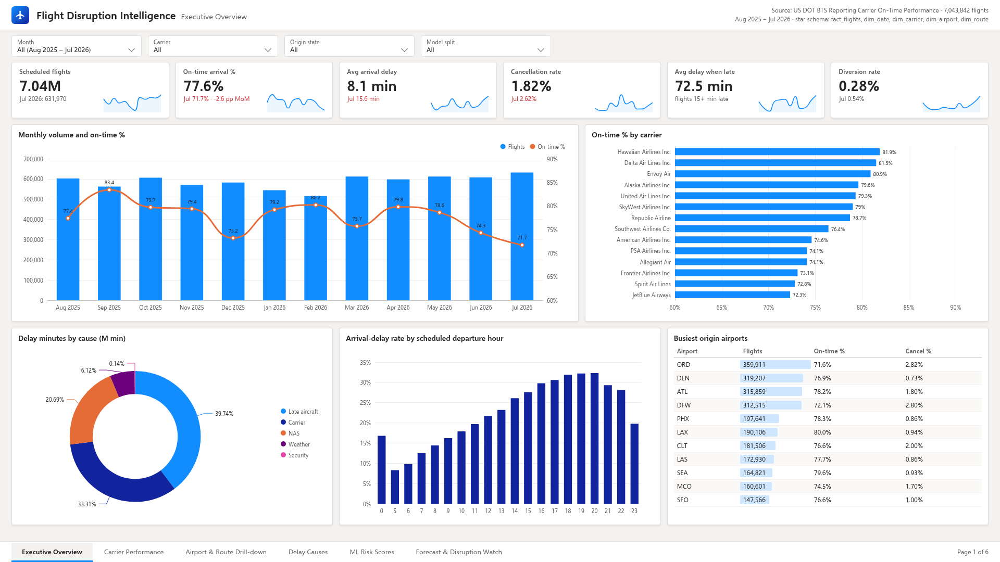

---

## The business problem

Over these 12 months, **22.4% of completed US flights arrived 15+ minutes late** and **1.82% were cancelled**. When a flight is late, it is late by **72.5 minutes on average**. Schedule planners, airport ops teams and travel managers all ask the same questions:

- *Where and when* does delay concentrate: carrier, airport, route, hour?
- *Why* is it happening: carrier issues, weather, air-traffic control, or knock-on late aircraft?
- *Which scheduled flights* carry the most risk, using only what's known when the schedule is published?
- *What's coming* over the next 7 days at the busiest airports, and which past days were real disruption events?

## What I built

| Layer | What it does |
|---|---|
| **Data pipeline** | Downloads 12 monthly BTS files (≈360 MB zipped) → typed Parquet → DuckDB. Enriches airports with OurAirports metadata. 26-check **data-quality gate** (pass/fail report) blocks the pipeline on failure |
| **SQL** | `sql/staging` (cleaning, quarantine of source errors) → `sql/marts` (on-time %, delay, cancellations, cause mix by carrier / airport / route / month / hour) → `sql/features` |
| **Machine learning** | Delay classifier, delay-minutes quantile regression (P10/P50/P90), cancellation risk, 7-day airport forecasting, airport & route segmentation, disruption-day anomaly detection, SHAP explanations. MLflow tracking, versioned artifacts, and a model card per model |
| **API** | FastAPI: `/predict/delay`, `/predict/cancellation`, `/explain`, `/forecast`, `/health`, with pydantic schemas and pytest tests |
| **App** | Streamlit: executive overview, delay-risk predictor (form → probability + SHAP reasons), forecasts, segments, disruption days, model performance |
| **Dashboard** | Six-page Power BI report on a star schema (`fact_flights`, `dim_date`, `dim_carrier`, `dim_airport`, `dim_route`, model score tables) with 37 DAX measures |
| **Engineering** | Makefile, Docker / docker-compose, GitHub Actions CI (ruff + pytest), notebooks with outputs |

## Key results (real numbers, held-out test window Jun–Jul 2026)

Models were trained on Aug 2025 – Mar 2026, tuned and calibrated on Apr – May 2026, and scored **once** on Jun – Jul 2026. Nothing was shuffled across time. The pre-departure models only use features that are known when the schedule is published.

**1 · Arrival delay > 15 min** (1,207,232 completed test flights, 27.0% delayed)

| Model | ROC-AUC | PR-AUC | F1 | Brier |
|---|---|---|---|---|
| Prior rate (baseline) | 0.500 | 0.271 | 0.000 | 0.2004 |
| Logistic regression (baseline) | 0.680 | 0.412 | 0.488 | 0.1841 |
| XGBoost | 0.681 | 0.415 | 0.487 | 0.1867 |
| **LightGBM + Optuna, isotonic-calibrated (served)** | **0.688** | **0.419** | **0.491** | **0.1857** |

The lift over logistic regression is real but small (+0.007 AUC). Most delay comes from same-day weather and knock-on effects, which nobody can know at scheduling time. Test months are also the summer peak, so the calibrated model under-predicts (mean predicted 20.8% vs observed 27.0%). For context, a *day-of-operations* variant that adds the actual aircraft rotation reaches 0.711 AUC. It is **not** served, because those tail numbers are only known after the fact (see leakage notes below).

**2 · Delay minutes, quantile LightGBM**

| Model | MAE (min) | RMSE (min) | Median AE |
|---|---|---|---|
| Global median (baseline) | 29.81 | 71.13 | 13.00 |
| Route median (baseline) | 29.69 | 71.08 | 13.00 |
| **LightGBM P50** | **28.84** | 70.13 | 12.53 |

Pinball loss beats the global-quantile baseline at P10 (4.05 vs 4.25), P50 (14.42 vs 14.90) and P90 (13.23 vs 14.15). The P90 covers 86.7% of test flights (target 90%) and the P10–P90 band covers 77.1% (target 80%): slightly narrow for summer.

**3 · Cancellation risk** (1,239,546 test flights, 2.14% cancelled; heavily imbalanced)

| Model | Validation PR-AUC | Test PR-AUC | Test ROC-AUC | Test Brier |
|---|---|---|---|---|
| Prior rate (baseline) | – | 0.021 | 0.500 | 0.0210 |
| **Logistic regression, class-weighted + Platt calibration (served)** | 0.0165 | **0.059** | **0.731** | **0.0210** |
| LightGBM, Optuna on PR-AUC, isotonic-calibrated | 0.0169 | 0.040 | 0.705 | 0.0210 |

The served model is the logistic regression. Validation PR-AUC slightly favoured LightGBM (0.0169 vs 0.0165), and LightGBM was served at first. But the validation window (Apr–May 2026) had an unusually low cancellation rate, 0.91% against 2.14% in the test window, and on test the simpler, more stable logistic regression generalises clearly better. I switched to it and kept both sets of numbers here. Because that decision used the test window, the served model's test numbers are slightly optimistic. Platt scaling is monotone, so the served probabilities rank exactly like the class-weighted model while sitting on a realistic scale. Its riskiest 1% of flights are cancelled 11.1% of the time (5.2× the base rate); LightGBM's riskiest 1% were below the base rate.

This is still the weakest model. Cancellations are driven by storms, ATC programs and IT/crew failures that a schedule can't reveal. Both models beat the prior; neither is good enough to act on alone.

**4 · 7-day forecasting, 10 busiest airports** (8 rolling origins × 7-day horizon)

| Target | LightGBM MAE | Seasonal naive MAE | 4-week weekday mean MAE |
|---|---|---|---|
| Arrival-delay rate | 9.32 pp | 10.30 pp | **8.60 pp** |
| Departures / day | 17.3 | **10.8** | 15.6 |

LightGBM beats seasonal-naive on delay rate but loses to a simple 4-week weekday mean. On departures (which follow the published schedule) seasonal-naive wins. The app flags this instead of hiding it.

**5 · Segmentation:** 172 airports → 6 segments (silhouette 0.195), 4,457 routes → 4 segments (0.224), e.g. *"Major hub – evening-heavy bank, long taxi-out / congested"*.
**6 · Disruption days:** STL residuals flag 25 of 365 network days. The worst is 2026-01-25, with 46.5% of flights cancelled. Isolation Forest flags 219 of 10,950 airport-days, and those days average a 68.0% delay rate vs 22.7% otherwise.

Full details are in [`reports/model_cards/`](./reports/model_cards) and [`reports/metrics/`](./reports/metrics).

## Dashboard

A six-page Power BI dashboard in a Fluent light theme, built on the star-schema exports in `data/powerbi/`. The Power BI files are in [`dashboard/`](./dashboard): open `dashboard/FlightDisruption.pbip` in Power BI Desktop and set the `DataFolder` parameter to your local `data/powerbi` folder. Every DAX measure is documented in [`dashboard/DAX_MEASURES.md`](./dashboard/DAX_MEASURES.md).

**Dashboard walkthrough (56 s):** [`artifacts/powerbi-dashboard-walkthrough.mp4`](./artifacts/powerbi-dashboard-walkthrough.mp4): a tour of the six dashboard pages, clicking through each page tab and zooming in on the KPI cards, slicers and key charts.

### Dashboard Pages

| | |
|---|---|
| **1 · Executive Overview**: volume, on-time %, delay, cancellations, cause mix, busiest airports  | **2 · Carrier Performance**: scorecard, punctuality vs cancellations, carrier × month heatmap, cause mix 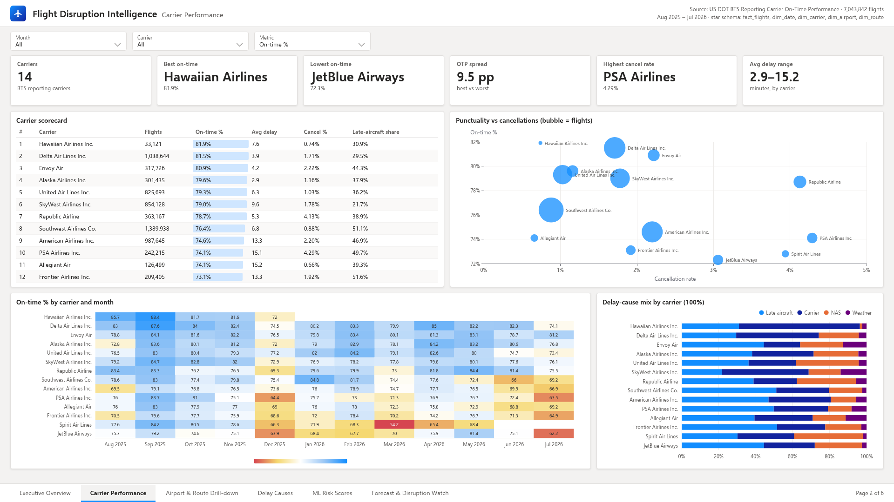 |
| **3 · Airport & Route Drill-down**: congestion vs delay, least reliable routes, hour × weekday heatmap 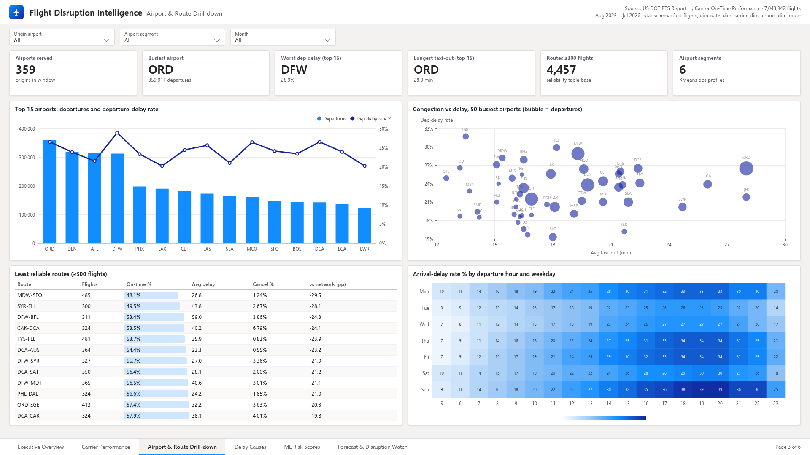 | **4 · Delay Causes**: cause minutes by month, cancellation reasons, weather-exposed airports 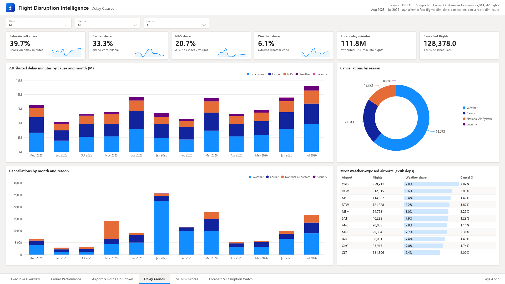 |
| **5 · ML Risk Scores**: calibration, predicted vs observed by hour and carrier, highest-risk routes 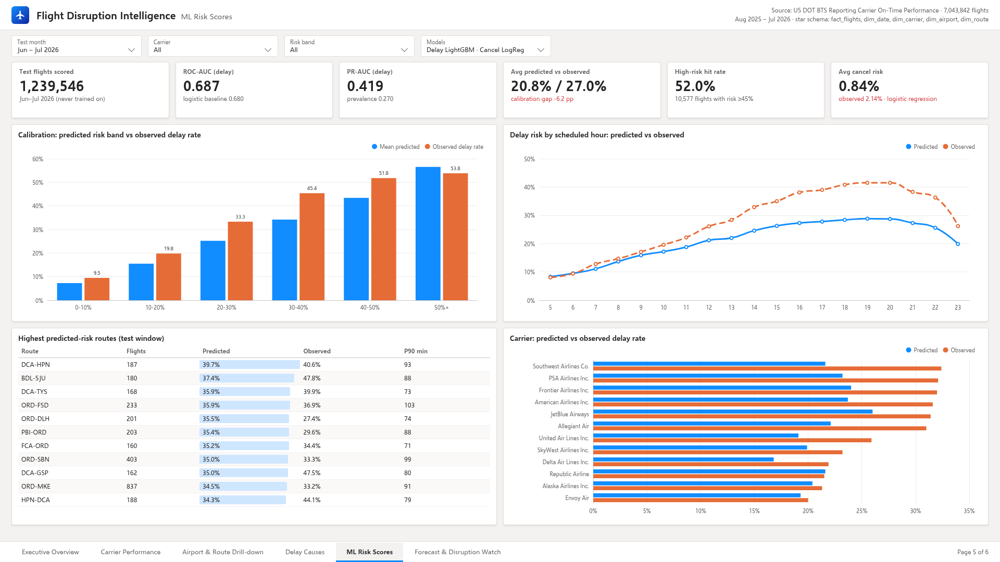 | **6 · Forecast & Disruption Watch**: flagged disruption days, 7-day forecast, backtest accuracy 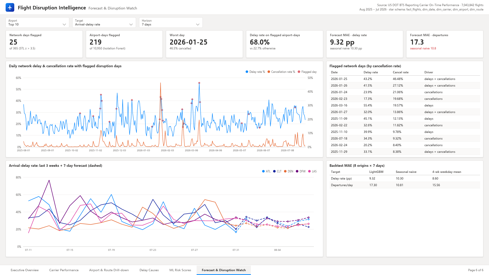 |

## App

| Executive overview | Delay risk predictor |
|---|---|
| 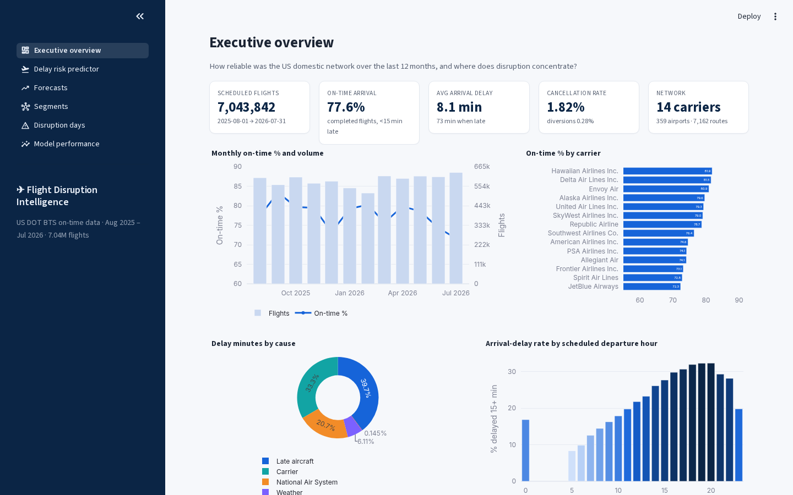 | 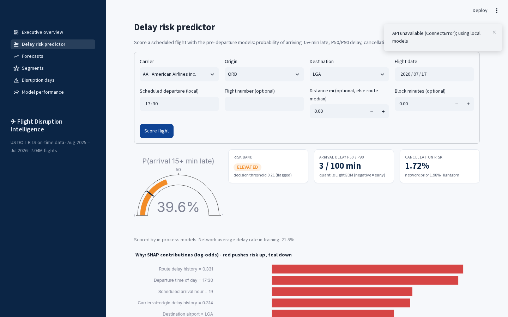 |
| **Forecasts** | **Segments** |
| 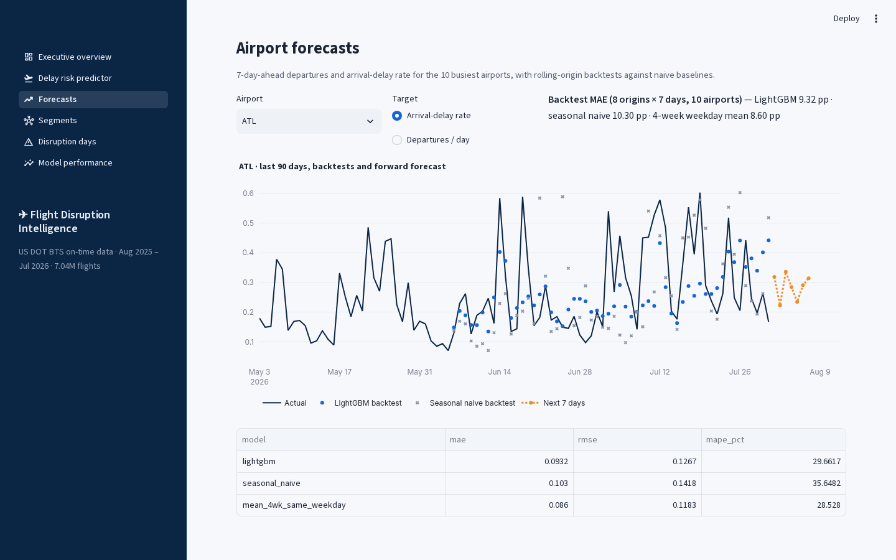 | 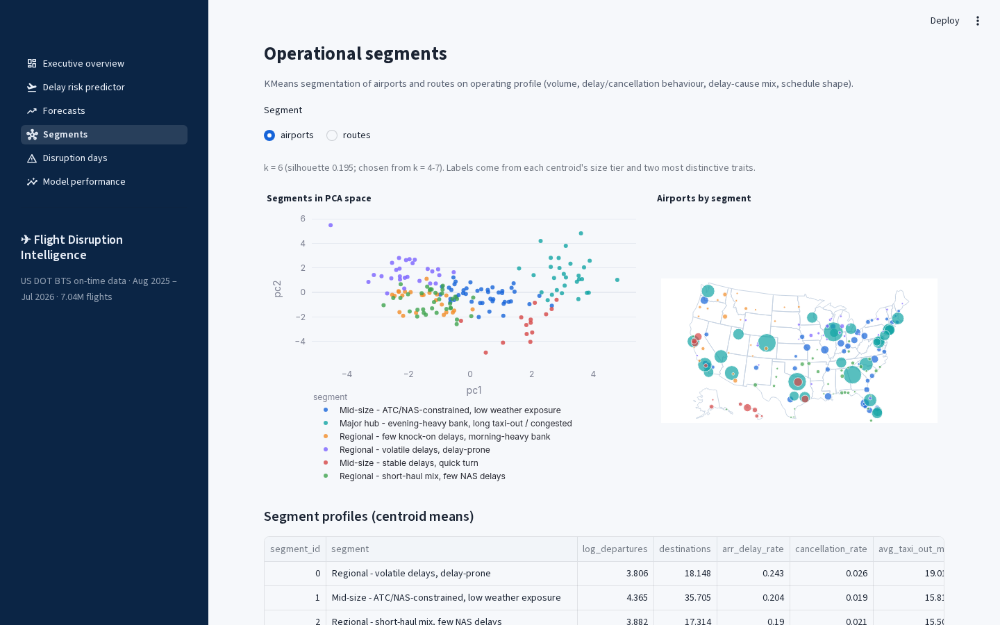 |
| **Disruption days** | **Model performance** |
| 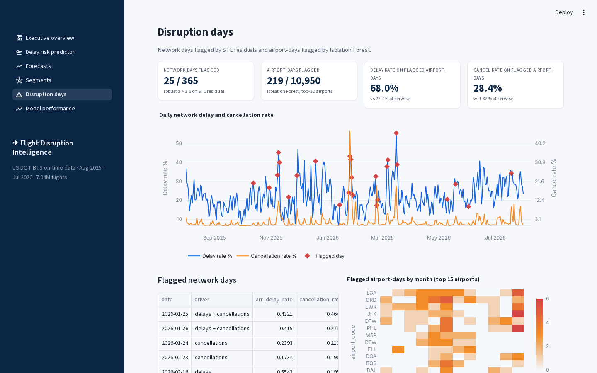 | 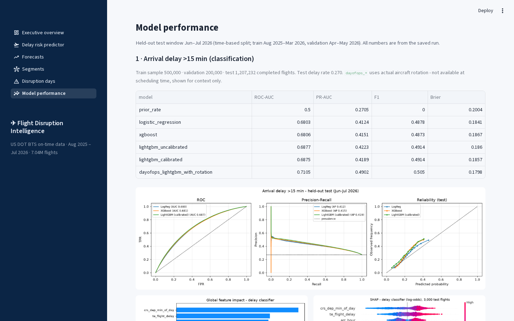 |

## Architecture

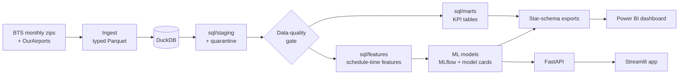

## Data

| | |
|---|---|
| Source | US DOT Bureau of Transportation Statistics, *Reporting Carrier On-Time Performance (1987–present)*, monthly PREZIP files from `transtats.bts.gov` |
| Enrichment | [OurAirports](https://ourairports.com/data/) airport metadata (all 359 airports matched); BTS `L_UNIQUE_CARRIERS` carrier names |
| Window | 2025-08-01 → 2026-07-31 (12 months, 365 days) |
| Rows | 7,043,858 raw → 16 quarantined (negative scheduled block time) → **7,043,842** in staging |
| Coverage | 14 carriers, 359 airports, 7,162 routes. Hawaiian Airlines reports through 2025-12-31 and Spirit through 2026-05-01 in this window |
| In the repo | 20,000-row raw sample (`data/sample/`), 50,000-row fact sample, all dimensions, marts, and model score tables. Full data: `make data && make pipeline` |

<details><summary>Rows per month</summary>

| Month | Rows |
|---|---|
| 2025-08 | 602,378 |
| 2025-09 | 562,439 |
| 2025-10 | 605,844 |
| 2025-11 | 570,550 |
| 2025-12 | 582,304 |
| 2026-01 | 544,003 |
| 2026-02 | 515,037 |
| 2026-03 | 612,102 |
| 2026-04 | 597,919 |
| 2026-05 | 611,735 |
| 2026-06 | 607,577 |
| 2026-07 | 631,970 |

</details>

**Data-quality gate:** 26 checks on uniqueness, completeness, validity, consistency, referential integrity and enrichment. All 26 pass. See [`reports/data_quality_report.md`](./reports/data_quality_report.md).

## How the ML avoids leakage

- **Time-based split** (train → validation → test, in calendar order). Optuna tuning, early stopping, calibration, threshold selection and model selection all use validation only.
- **Schedule-time features only:** carrier, airports, scheduled times, distance, block time, weekday, holiday proximity, schedule congestion counts, and target encodings of route / carrier-airport / flight number.
- **Out-of-fold target encoding:** training rows get 5-fold out-of-fold encodings. Validation/test rows get statistics from the training window only.
- **Features I removed after checking:** aircraft-rotation features built from the BTS tail number (a missing tail is 100% cancelled, because the tail is recorded after the fact) and day-of-month (it memorises specific storm days). The checks are shown in [`notebooks/02_feature_engineering.ipynb`](./notebooks/02_feature_engineering.ipynb).
- **Training sample sizes:** to keep runs fast on a laptop, the classifiers train on a uniform sample of 500,000 flights (validation 200,000) and the regression on 400,000 (validation 150,000). **Test metrics use every flight** in Jun–Jul 2026.

## Run it

```bash
pip install -r requirements.txt -r requirements-dev.txt
export PYTHONPATH=src:.

# Try the API and app right away (trained models and marts are in the repo)
make api          # http://localhost:8000/docs
make app          # http://localhost:8501   (set API_URL=http://localhost:8000 to score through the API)
make test         # SQL layer + DQ gate on the sample, API tests on the saved models

# Rebuild everything from the public source
make data         # download 12 months of BTS + reference files
make pipeline     # ingest -> SQL -> DQ gate -> features -> models -> dashboard exports
make mlflow-ui    # browse runs in ./mlruns
```

Docker: `docker compose up --build` starts the API (8000) and the app (8501).

```bash
curl -X POST localhost:8000/predict/delay -H 'content-type: application/json' \
  -d '{"carrier":"AA","origin":"ORD","dest":"LGA","flight_date":"2026-07-17","crs_dep_time":1730,"flight_number":"1234"}'
```

## Repository layout

```
sql/            staging, marts and feature SQL
src/flightops/  ingest, quality gate, features, models/, serving, exports
api/            FastAPI service + schemas
app/            Streamlit app
dashboard/      Power BI report, theme, DAX measures
notebooks/      01 EDA, 02 feature engineering & leakage checks (executed)
models/         versioned model artifacts + lookups + registry.json
reports/        data-quality report, metrics JSON, model cards, figures
data/           sample, reference subsets, marts, dashboard exports
tests/          pytest suite (runs in CI)
```

## Limitations

- Pre-departure delay prediction has a low ceiling. The best model reaches 0.688 ROC-AUC, only slightly above logistic regression.
- The test window is summer peak. Calibrated probabilities under-predict by about 6 pp, so a production version would recalibrate on recent weeks.
- The cancellation model is weak. The served logistic regression was chosen after seeing the test window (validation slightly favoured LightGBM), and its calibrator was fitted on a low-cancellation spring window, so it under-predicts summer risk (0.84% average predicted vs 2.14% observed).
- Forecasting beats seasonal-naive on delay rate but not on departures, and a simple 4-week weekday mean is still the best delay-rate forecaster.
- With only 12 months of history there's no year-over-year seasonality: the model never saw a previous June or July.
- No weather data. Adding forecast weather as a day-ahead feature is the obvious next step.
- The Docker setup is included but not part of CI.

## What's next

- Day-ahead model with NOAA forecast weather and FAA ground-delay programs (a separate, clearly labelled prediction horizon)
- Rolling monthly retraining + recalibration, with drift monitoring on the calibration gap
- Connection-risk scoring for itineraries using the P90 delay estimate
- Longer history (3+ years) for proper yearly seasonality in forecasting

---

Built by **Nishant Tyagi**, New Delhi · Python · SQL · DuckDB · LightGBM · XGBoost · Optuna · SHAP · MLflow · FastAPI · Streamlit · Power BI
